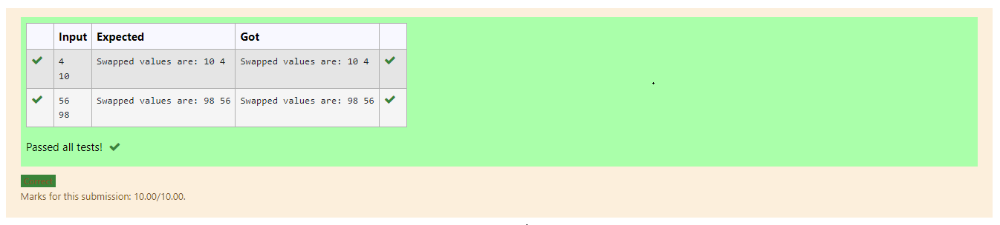

# Swapping-two-values
## AIM:
To write a python program for swapping of two values
## EQUIPEMENT'S REQUIRED: 
PC
Anaconda - Python 3.7
## ALGORITHM: 
### Step 1:
Get the two values from the user
### Step 2: 
Assign the value of second variable to a temporary variable 
### Step 3: 
Assign the value of the first variable to the second variable.
### Step 4:  
Assign the value in temporary variable to the first variable
### Step 5: 
Print both the values it would be interchanged
### Step 6: 
End the program
## PROGRAM:
~
a=int(input("Enter the first variable:"))
b=int(input("Enter the second variable:"))
print("Before swapping : \na=",a,"\nb=",b)
t=b
b=a
a=t
print("After swapping : \na=",a,"\nb=",b)
~
## OUTPUT:

## RESULT:
Thus the swapping of two values are successfully executed
